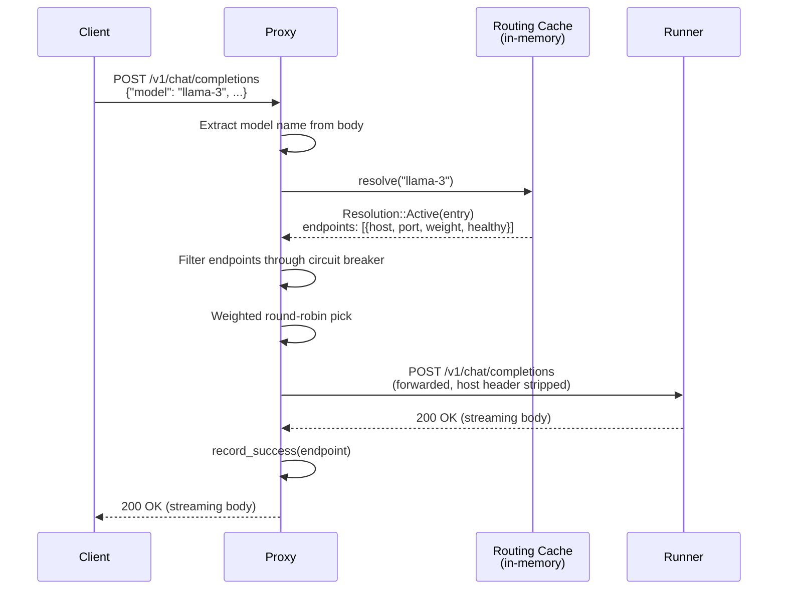
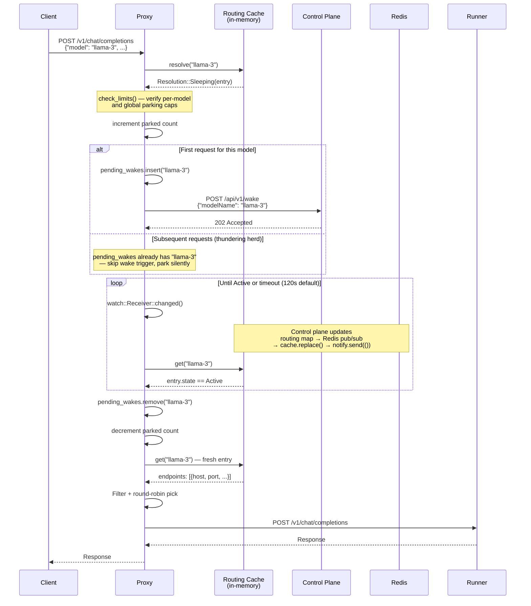
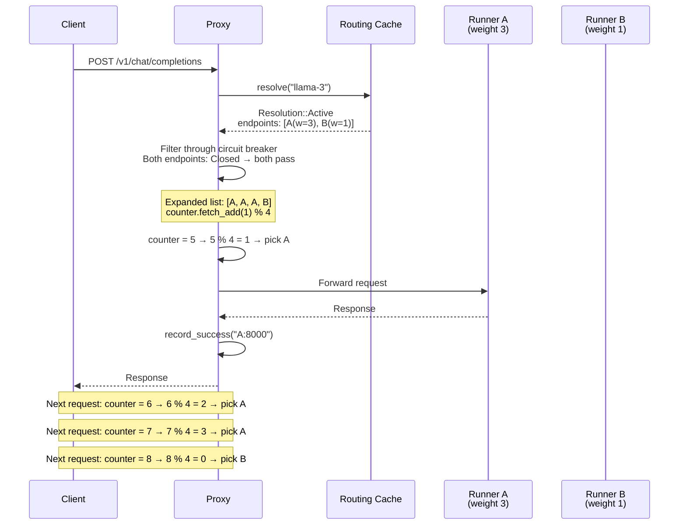
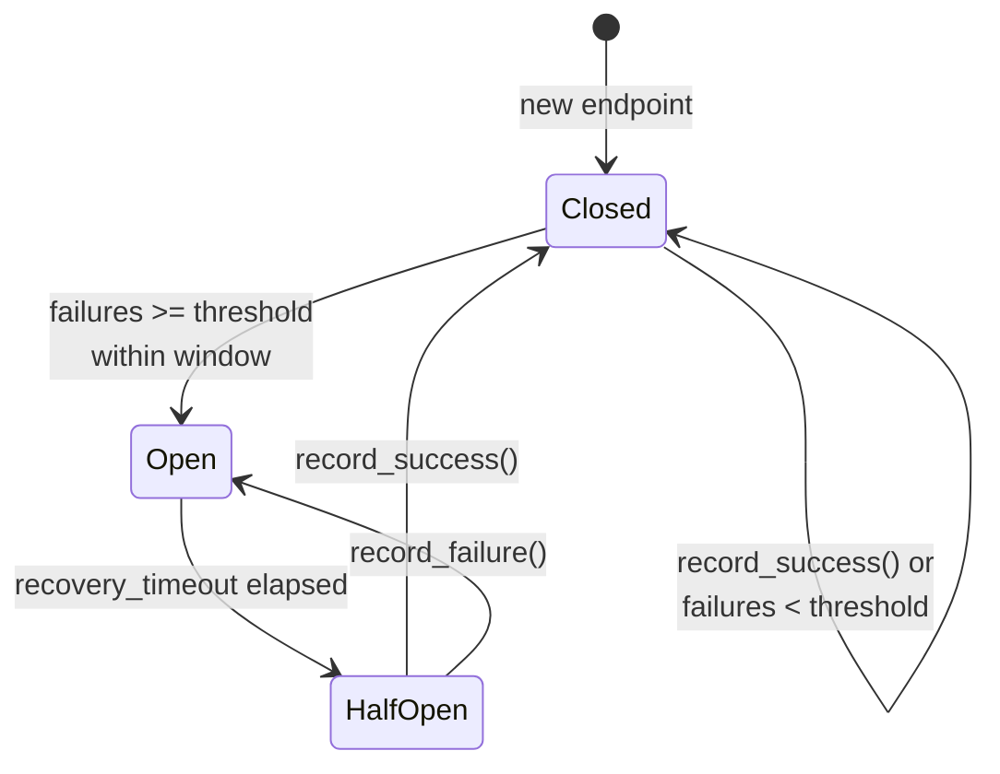

# Routing Proxy

The routing proxy is the Sardeenz component that sits on the critical path of every inference request. It is a stateless Rust (axum/tokio) service that resolves model names to runner endpoints, handles connection parking when models are sleeping, and forwards traffic to the appropriate runner.

For the overall system context, see the [architecture overview](../overview.md). For the proxy ↔ control plane data contract, see [`packages/contracts/specs/proxy-control-plane.yaml`](../../../packages/contracts/specs/proxy-control-plane.yaml).

For the Rust choice rationale, see [ADR-003](../adrs/adr-003-rust-proxy.md).

## Scope

The proxy owns the **inference request path** — from client connection to runner response. It does not:

- **Make orchestration decisions.** The control plane decides where models run, when to sleep them, and how to allocate device memory. The proxy reads the output of those decisions (the routing map) and acts on them.
- **Health-check runners directly.** The control plane owns runner health. The proxy applies its own per-endpoint circuit breaker as a last-resort backstop, but does not poll runners.
- **Persist state.** The proxy is fully stateless across replicas. Routing state lives in Redis. Circuit breaker and parking state are per-replica and ephemeral.
- **Serve admin traffic.** Admin routes (`/healthz`, `/readyz`, `/metrics`) are on a separate port and not part of the inference path.

## Overview

The proxy exposes three inference endpoints on its primary port (default `0.0.0.0:8080`):

| Endpoint               | Method | Purpose                                         |
| ---------------------- | ------ | ----------------------------------------------- |
| `/v1/chat/completions` | `POST` | Chat inference (forwarded to runner)            |
| `/v1/completions`      | `POST` | Text completion inference (forwarded to runner) |
| `/v1/models`           | `GET`  | List active and sleeping models                 |

A separate admin server on `0.0.0.0:9099` exposes `/healthz`, `/readyz`, and `/metrics`. The admin port is never exposed outside the cluster.

The proxy is designed to run as multiple stateless replicas behind a load balancer. Replicas share no in-process state — all coordination happens through the Redis routing map.

## Request Flow

### Hot Path Summary

Every inference request follows the same steps:

1. Read the raw request body (buffered, max 10 MiB)
2. Extract the `model` field from the JSON payload
3. Resolve the model's current state from the in-memory routing cache
4. If sleeping, park the connection and fire a wake trigger; if starting (wake already in progress), park without triggering
5. Filter endpoints through the circuit breaker
6. Pick an endpoint via weighted round-robin
7. Forward the request and stream the response back
8. Record success or failure on the circuit breaker

### Scenario 1: Active Model



The routing cache is always local (in-memory). There is no Redis call on the hot path once the cache is populated.

### Scenario 2: Sleeping Model



The client connection is held open throughout. The proxy never disconnects the client during parking.

### Scenario 3: Multiple Replicas (Weighted Round-Robin)



The `WeightedRoundRobin` balancer builds an expanded endpoint list where each endpoint appears `weight` times, then uses a global atomic counter modulo the list length. Weight 0 effectively removes an endpoint from rotation — used for graceful drain.

## Connection Parking Protocol

When the resolver returns `Resolution::Sleeping`, the request enters the parking subsystem. The `ParkingManager` holds the Tokio task at an `await` point, preserving the client connection without consuming a thread.

### Thundering Herd Prevention

The `pending_wakes` map (type `Arc<Mutex<HashMap<String, ()>>>`) serializes wake triggers:

```
park("llama-3", fire_wake: true):
  1. lock pending_wakes
  2. if "llama-3" not present:
       insert "llama-3" → ()
       drop lock
       call wake_client.trigger_wake("llama-3")  ← only this task fires the trigger
  3. else:
       drop lock                                  ← all other tasks skip the trigger
  4. subscribe to routing_cache watch channel
  5. loop: wait for cache change or timeout
```

All parked tasks for the same model share the same `watch::Receiver` subscription — they all wake up when the routing cache is updated, check whether the model is now `ACTIVE`, and proceed if so.

If the wake trigger call fails, `pending_wakes` removes the entry so the next parked task can retry.

### `Starting` State

When the resolver returns `Resolution::Starting`, the model's wake is already in progress (the control plane has set state to `STARTING` in the routing map). The proxy calls `park(..., fire_wake: false)`. No wake trigger is sent — the task simply parks and waits for `ACTIVE`.

### State Transitions During Parking

The parking loop checks for the following terminal conditions on every wake from `receiver.changed()`:

| State in cache | Action                                                                                                                                                          |
| -------------- | ---------------------------------------------------------------------------------------------------------------------------------------------------------------------------- |
| `ACTIVE`       | Remove from `pending_wakes`, return `Ok(())`, proceed to forward                                                                                                |
| `ERROR`        | Remove from `pending_wakes`, return `Err(ModelUnavailable)` → 503                                                                                               |
| Entry removed  | Remove from `pending_wakes`, return `Err(ModelNotFound)` → 404                                                                                                  |
| `DRAINING`     | Remove from `pending_wakes`, return `Err(ModelUnavailable)` → 503 (matches the resolver's up-front fail-fast for draining models)                             |
| `SLEEPING`     | If the model has already left `SLEEPING` during this wait, treat as a rollback: remove from `pending_wakes`, return `Err(ModelUnavailable)` → 503 (client retry re-triggers cleanly). Still-`SLEEPING` before the wake has progressed is not a rollback — keep waiting. |

`STARTING` — and `SLEEPING` before the model has been observed leaving it — cause the loop to keep waiting; the wake is still in progress.

### Timeout and Backpressure

Two independent limits protect the proxy from runaway parking:

| Limit         | Config key                       | Default | Scope              |
| ------------- | -------------------------------- | ------- | ------------------ |
| Per-model cap | `SARDEENZ_PARKING_MAX_PER_MODEL` | 1000    | Per model name     |
| Global cap    | `SARDEENZ_PARKING_MAX_GLOBAL`    | 10000   | Across all models  |
| Deadline      | `SARDEENZ_PARKING_TIMEOUT_SECS`  | 120     | Per parked request |

Limits are checked before incrementing the count. Excess requests receive a 503 (`parking_limit_reached`). The deadline uses `tokio::time::sleep_until` inside a `select!` with the `receiver.changed()` future — if the deadline fires first, the task returns `Err(ParkingTimeout)` → 503 (`parking_timeout`).

## Routing Map

### Redis Key Structure

The control plane maintains the routing map as a Redis hash:

| Key                        | Type            | Description                                                                           |
| -------------------------- | --------------- | ------------------------------------------------------------------------------------- |
| `sardeenz:routing-map`     | Hash            | One field per model. Field name = model name. Value = JSON-serialized `RoutingEntry`. |
| `sardeenz:routing-updates` | Pub/sub channel | Receives `RoutingMapUpdate` JSON on every routing map change.                         |

### RoutingEntry Format

Each hash field value is a JSON-serialized `RoutingEntry`:

```json
{
  "modelName": "meta-llama/Llama-3.1-8B-Instruct",
  "state": "ACTIVE",
  "endpoints": [
    {
      "host": "10.244.1.5",
      "port": 8000,
      "weight": 1,
      "healthy": true,
      "runnerId": "runner-abc123"
    }
  ],
  "updatedAt": "2026-06-12T10:30:00Z",
  "metadata": {
    "ownedBy": "platform-team",
    "maxModelLen": 131072,
    "engineType": "vllm"
  }
}
```

A sleeping model has `"state": "SLEEPING"` and an empty `endpoints` array. The metadata block is optional and passed through to `/v1/models` responses without interpretation.

### Model States

| State      | Proxy action                                           |
| ---------- | ------------------------------------------------------ |
| `ACTIVE`   | Forward to endpoints via round-robin                   |
| `SLEEPING` | Park connection, fire wake trigger                     |
| `STARTING` | Park connection, no wake trigger (already in progress) |
| `DRAINING` | Reject with 503 (`model_unavailable`)                  |
| `ERROR`    | Reject with 503 (`model_unavailable`)                  |

### Refresh Strategy

On startup, the proxy performs a full `HGETALL sardeenz:routing-map` and populates `RoutingMapCache`. It then subscribes to `sardeenz:routing-updates` for incremental updates.

On any pub/sub message, the proxy re-fetches the full hash with `HGETALL` and replaces the in-memory map atomically. This avoids applying partial or out-of-order deltas — the map is small enough (one entry per deployed model) that a full re-read is safe and simpler.

```
pub/sub message received:
  1. HGETALL sardeenz:routing-map
  2. Parse each field: serde_json::from_str::<RoutingEntry>(&value)
  3. routing_cache.replace(new_map).await
     → *inner.write() = new_map
     → notify.send(())          ← wakes all parked tasks
```

Fields that fail JSON parsing are logged as warnings and dropped. A parse failure for one model does not block the refresh for others.

If the Redis connection drops, `start_redis_sync` returns an error. The main loop logs the error, marks the proxy as not ready (fails `/readyz`), and retries the connection after a 5-second back-off. The in-memory cache remains intact during the gap — it may become stale but does not clear.

### Scale Assumptions

The full-refresh strategy (HGETALL on every pub/sub event) is designed for the following envelope:

| Dimension         | Expected range             | Notes                                   |
| ----------------- | -------------------------- | --------------------------------------- |
| Model count       | 10–100                     | One routing entry per deployed model    |
| Entry size        | < 1 KB each                | A few endpoints + metadata per model    |
| Total map size    | < 100 KB                   | Fits comfortably in a single HGETALL    |
| Pub/sub frequency | < 1 event/second sustained | Bursts during batch operations are fine |

**When to revisit:** If the model count exceeds ~500, or if pub/sub events exceed ~10/second sustained, the full-refresh approach may become a bottleneck. At that point, consider incremental delta application (using the `RoutingMapUpdate` type already defined in the spec) or per-model key reads instead of HGETALL.

### Cache Invalidation

There is no TTL-based expiry. The in-memory cache is authoritative between pub/sub updates. Staleness is bounded by the latency of the pub/sub notification path (typically a few milliseconds).

## Circuit Breaker

The proxy maintains a per-endpoint circuit breaker to protect against failed or degraded runners. The endpoint key is `"{host}:{port}"`.

### States



| State      | `is_allowed()` | Description                                                    |
| ---------- | -------------- | -------------------------------------------------------------- |
| `Closed`   | `true`         | Normal operation. Failures accumulate in a sliding window.     |
| `Open`     | `false`        | Endpoint is excluded from routing.                             |
| `HalfOpen` | `true`         | Probe phase — one request is allowed through to test recovery. |

### Thresholds and Recovery

| Parameter         | Config key                          | Default | Description                                       |
| ----------------- | ----------------------------------- | ------- | ------------------------------------------------- |
| Failure threshold | `SARDEENZ_CB_FAILURE_THRESHOLD`     | 5       | Failures within window that trip the breaker      |
| Failure window    | `SARDEENZ_CB_FAILURE_WINDOW_SECS`   | 30      | Sliding window for failure counting (seconds)     |
| Recovery timeout  | `SARDEENZ_CB_RECOVERY_TIMEOUT_SECS` | 15      | Time in `Open` before transitioning to `HalfOpen` |

Failures outside the window are pruned on each `record_failure()` call. The state check is lazy — `Open → HalfOpen` transition is computed when `state()` or `is_allowed()` is called, not on a timer.

A claimed `HalfOpen` probe is normally released the instant its outcome is recorded (or if the request is cancelled). As a leak backstop, a probe is also treated as re-claimable after `max(recovery_timeout, upstream_timeout)` elapses — deliberately not `recovery_timeout` alone, since a legitimate in-flight probe can run as long as `upstream_timeout`, and reclaiming it earlier would admit a second probe on top of a still-recovering endpoint. This window is derived internally and has no separate env var.

### When All Endpoints Are Open

If every endpoint for a model has an open circuit breaker, `balancer.pick()` returns `None`. The proxy returns 503 (`all_endpoints_unhealthy`). The control plane's own health monitoring should detect this condition and update the routing map (e.g., marking the model `ERROR` or routing to a different worker).

Circuit breaker state is per-replica and not shared across proxy replicas. A failing runner appears independently broken to each replica.

## Configuration Reference

All configuration is read from environment variables at startup via `Config::from_env()`.

| Variable                            | Type         | Default                  | Description                                                              |
| ----------------------------------- | ------------ | ------------------------ | ------------------------------------------------------------------------ |
| `SARDEENZ_LISTEN_ADDR`              | `SocketAddr` | `0.0.0.0:8080`           | Inference server bind address                                            |
| `SARDEENZ_ADMIN_ADDR`               | `SocketAddr` | `0.0.0.0:9099`           | Admin server bind address (health + metrics)                             |
| `SARDEENZ_REDIS_URL`                | `String`     | `redis://127.0.0.1:6379` | Redis/Valkey connection URL                                              |
| `SARDEENZ_CONTROL_PLANE_URL`        | `String`     | `http://127.0.0.1:3000`  | Control plane base URL for wake triggers                                 |
| `SARDEENZ_LOG_LEVEL`                | `String`     | `info`                   | Log level (`trace`, `debug`, `info`, `warn`, `error`)                    |
| `SARDEENZ_UPSTREAM_TIMEOUT_SECS`    | `u64`        | `300`                    | Timeout for forwarded requests to runners (includes streaming)           |
| `SARDEENZ_REDIS_KEY_PREFIX`         | `String`     | `sardeenz`               | Prefix for Redis keys and pub/sub channels (e.g. `sardeenz:routing-map`) |
| `SARDEENZ_PARKING_TIMEOUT_SECS`     | `u64`        | `120`                    | Max time a request can be parked before returning 503                    |
| `SARDEENZ_PARKING_MAX_PER_MODEL`    | `usize`      | `1000`                   | Max concurrently parked requests per model                               |
| `SARDEENZ_PARKING_MAX_GLOBAL`       | `usize`      | `10000`                  | Max concurrently parked requests across all models                       |
| `SARDEENZ_CB_FAILURE_THRESHOLD`     | `u32`        | `5`                      | Failures within window to trip a circuit breaker                         |
| `SARDEENZ_CB_FAILURE_WINDOW_SECS`   | `u64`        | `30`                     | Sliding window for circuit breaker failure counting                      |
| `SARDEENZ_CB_RECOVERY_TIMEOUT_SECS` | `u64`        | `15`                     | Time before an open circuit transitions to half-open                     |

All socket address and numeric values are validated at startup; a parse failure causes the process to exit immediately.

## Metrics Reference

Metrics are exposed in Prometheus text format on `GET /metrics` (admin port). All metric names use the `sardeenz_proxy_` prefix.

| Metric                                    | Type      | Labels                             | Description                                             |
| ----------------------------------------- | --------- | ---------------------------------- | ------------------------------------------------------- |
| `sardeenz_proxy_requests_total`           | Counter   | `model`, `endpoint`, `status_code` | Total inference requests, by outcome                    |
| `sardeenz_proxy_request_duration_seconds` | Histogram | —                                  | End-to-end request latency, excluding parking wait time |
| `sardeenz_proxy_active_connections`       | Gauge     | —                                  | Currently active forwarded connections                  |
| `sardeenz_proxy_parked_connections`       | Gauge     | `model`                            | Currently parked connections, per model                 |
| `sardeenz_proxy_wake_triggers_total`      | Counter   | —                                  | Wake triggers fired to the control plane                |
| `sardeenz_proxy_parking_duration_seconds` | Histogram | —                                  | Time a request spent parked before forwarding           |
| `sardeenz_proxy_circuit_breaker_state`    | Gauge     | `endpoint`                         | Circuit breaker state: 0=closed, 1=open, 2=half-open    |
| `sardeenz_proxy_routing_parse_errors_total` | Counter | `model`                            | Routing entries that failed to deserialize during Redis sync, per model |

## Health Endpoints

Both endpoints are served on the admin port (`SARDEENZ_ADMIN_ADDR`).

### `GET /healthz`

Always returns `200 OK` with body `ok` if the process is running. This is a liveness probe — it does not check Redis connectivity or routing map freshness.

### `GET /readyz`

Returns `200 OK` with body `ready` when the proxy has an active Redis connection. Returns `503 Service Unavailable` with body `not ready` when Redis is disconnected.

The readiness signal is set by `AppState::set_redis_connected(true)` at the start of `start_redis_sync()` and cleared to `false` when the Redis connection drops. Kubernetes should use this endpoint for readiness gates — a proxy with no Redis connection has a stale routing cache and should not receive traffic.

## Relationship to the Control Plane

The proxy and control plane communicate through two channels: Redis (shared state) and a direct HTTP call (wake trigger).

### What the Proxy Reads

| Redis key                            | Access pattern                                            | Purpose                            |
| ------------------------------------ | --------------------------------------------------------- | ---------------------------------- |
| `sardeenz:routing-map` (hash)        | Full read at startup; full re-read on every pub/sub event | Populate and refresh routing cache |
| `sardeenz:routing-updates` (pub/sub) | Subscription                                              | Trigger routing cache refresh      |

The proxy never writes to Redis.

### What the Proxy Writes

The proxy makes exactly one HTTP call to the control plane: `POST /api/v1/wake` when a sleeping model needs to wake. This call is:

- **Fire-and-forget at the protocol level.** The control plane responds `202 Accepted` immediately; the actual wake-up is asynchronous.
- **Deduplicated by the proxy.** The `pending_wakes` map ensures only one trigger per model per wake event, regardless of how many requests are parked.
- **Deduplicated by the control plane.** The spec declares this endpoint idempotent — duplicate triggers from multiple proxy replicas are safe.
- **Timeout-bounded.** The wake trigger HTTP call has a 5-second timeout. A timeout causes the triggering task to fail with `ModelUnavailable` and removes the `pending_wakes` entry so subsequent parked tasks can retry.

### Wake Trigger Contract

```
POST {SARDEENZ_CONTROL_PLANE_URL}/api/v1/wake
Content-Type: application/json

{
  "modelName": "meta-llama/Llama-3.1-8B-Instruct",
  "requestId": null
}
```

The control plane responds `202 Accepted`. Any non-2xx response is treated as a failure. After a successful trigger, the proxy does not poll the control plane — it waits for the routing map to reflect `ACTIVE` via Redis pub/sub.

The full wake trigger schema is defined in [`packages/contracts/specs/proxy-control-plane.yaml`](../../../packages/contracts/specs/proxy-control-plane.yaml).

### Division of Responsibility

| Concern                                   | Owner         |
| ----------------------------------------- | ------------- |
| VRAM budget accounting                    | Control plane |
| Eviction decisions (which model to sleep) | Control plane |
| Runner health polling                     | Control plane |
| Routing map writes                        | Control plane |
| Wake orchestration (commands to runner)   | Control plane |
| Request routing                           | Proxy         |
| Connection parking                        | Proxy         |
| Per-endpoint circuit breaking             | Proxy         |
| Client-facing streaming                   | Proxy         |
| Redis pub/sub subscription                | Proxy         |

## Security and Trust Model

The proxy trusts the routing map completely. It forwards requests to whatever `host:port` endpoints appear in the routing map entries retrieved from Redis. This is architecturally intentional — the proxy is a stateless routing layer, not a policy enforcement point.

**Implication:** compromising Redis or the routing-map writer (the control plane) is equivalent to controlling all request routing. An attacker who can write to `sardeenz:routing-map` can redirect inference traffic to arbitrary endpoints (SSRF via routing map poisoning).

### Trust Boundaries

| Trust boundary          | What it protects                       | Required controls                                |
| ----------------------- | -------------------------------------- | ------------------------------------------------ |
| Redis/Valkey access     | Routing map integrity                  | AUTH/ACLs, network policy, TLS in transit        |
| Control plane API       | Routing map writes, wake orchestration | Authentication, authorization, network isolation |
| Proxy admin port (9099) | Health/readiness/metrics exposure      | Not exposed outside the cluster                  |
| Proxy ↔ runners         | Inference traffic integrity            | Network policy; mTLS for sensitive workloads     |

### Deployment Requirements

A Phase 1 deployment **must** include at minimum:

- **Authenticated ingress/gateway** in front of the proxy — the proxy does not authenticate clients
- **Network policy** isolating proxy, control plane, Redis, and runners into a trusted mesh
- **Redis AUTH** or ACLs preventing unauthorized routing-map access
- **Admin port isolation** — port 9099 must not be exposed to untrusted networks

These are not optional hardening steps — they are prerequisites for a safe deployment. Without them, the proxy is an open relay to whatever the routing map points at.
