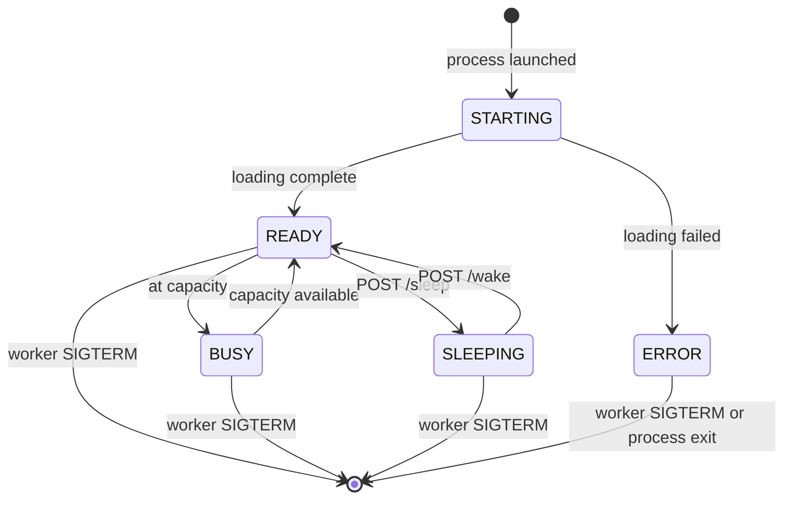

# Engine Runner Contract

The runner contract is the HTTP interface that every inference engine runner must implement for the Sardeenz control plane to manage its lifecycle. This document describes the contract's design, state model, communication patterns, and extension points.

For the formal specification, see [`packages/contracts/specs/engine-runner.yaml`](../../../packages/contracts/specs/engine-runner.yaml) (OpenAPI 3.1.0).

For the runner abstraction rationale, see [ADR-010](../adrs/adr-010-engine-runners.md).

## Scope

The contract covers the **management sideband** — the endpoints the control plane uses to orchestrate runners. It does not cover:

- **Inference traffic.** Model serving endpoints (e.g., `/v1/chat/completions`) flow through the engine's native API and the routing proxy. They are not part of this contract.
- **Process lifecycle.** Starting the runner process, capturing its stdout/stderr, detecting process exit, and stopping the runner (SIGTERM) are worker-level concerns.
- **Drain and stop.** Draining is a routing concern — the control plane removes the runner from the routing map, and the proxy stops sending traffic. Stopping is a process concern — the worker sends SIGTERM. Neither requires an HTTP endpoint on the runner.
- **Device memory push.** Workers periodically push device memory snapshots to Redis/Valkey for the control plane's global view. The runner contract's `/memory-report` is a pull endpoint for on-demand queries.

## Management and Inference Ports

A runner exposes two logically distinct HTTP surfaces, which may live on **separate ports**:

- **Management port** — the runner-contract API this document describes (`/health`, `/progress`, `/memory-report`, `/sleep`, `/wake`, `/sleep-status`, `/capabilities`). The control plane uses it for lifecycle and health.
- **Inference (engine) port** — the engine's native OpenAI-compatible API (`/v1/*`) that the routing proxy forwards client traffic to.

When the worker starts a runner, its `StartRunnerResponse` reports the management port as `port` and the inference port as the optional `enginePort` (see [`worker-agent.yaml`](../../../packages/contracts/specs/worker-agent.yaml)). The worker allocates these as a **pair** so a second runner's management port cannot collide with the first runner's engine port.

- **Two-port engines (e.g. vLLM):** vLLM's OpenAI server listens on a port distinct from the runner shim's management port. The shim reports both; the control plane health-polls the management port but **registers the engine port** as the model's routing-map endpoint, so the proxy reaches the engine directly.
- **Single-server runners (e.g. the dev-worker stub):** one server answers both the contract API and `/v1/*`, so `enginePort` equals `port`. When `enginePort` is omitted, the control plane registers `port` as the inference endpoint.

The control plane persists the engine port (`runnerEnginePort`) so sleep→wake re-registers the same endpoint.

## Runner State Model

A runner progresses through five states. The state is always available via `GET /health`.



### State Definitions

| State      | Accepts inference? | Description                                                                                                                                    |
| ---------- | ------------------ | ---------------------------------------------------------------------------------------------------------------------------------------------- |
| `STARTING` | No                 | Runner is initializing — loading weights, allocating device memory, capturing CUDA graphs. Progress available via `GET /progress`.             |
| `READY`    | Yes                | Runner is ready and has capacity for new requests.                                                                                             |
| `BUSY`     | No (at capacity)   | Runner is healthy but saturated. Existing requests continue; new requests should be routed elsewhere. The runner self-reports this transition. |
| `SLEEPING` | No                 | Runner has offloaded device memory (weights to host RAM). Device memory is freed. Wake with `POST /wake` to return to `READY`.                 |
| `ERROR`    | No                 | Unrecoverable error. The runner should be stopped and restarted. Error details in the `message` field of `GET /health`.                        |

### Key Transitions

- **READY ↔ BUSY:** Self-reported by the runner based on its own capacity assessment (e.g., request queue depth, KV cache pressure). The control plane does not command this transition. Currently, the control plane treats `BUSY` as equivalent to `READY` and does not adjust routing (see [ADR-014](../adrs/adr-014-inference-recency-tracking.md)).
- **READY → SLEEPING:** The control plane sends `POST /sleep` with a level. Only valid from `READY` — a `BUSY` runner must return to `READY` (no in-flight requests) before it can be slept. The call is synchronous — the response returns after the offload completes. The control plane sets an appropriate HTTP timeout based on the model size.
- **→ [*] (stopped):** The control plane removes the runner from the routing map (stopping new traffic), monitors `activeRequests` in `GET /health` until in-flight work completes, then tells the worker to send SIGTERM. The runner does not receive an HTTP command to stop — process lifecycle is a worker concern.
- **→ ERROR:** Self-reported by the runner. Can occur from any active state. The control plane detects it via health polling and decides whether to restart or escalate.

### Runner State to Routing Map Mapping

The runner contract defines per-runner states (`RunnerState`), while the proxy routing map operates on per-model states (`ModelState`) with per-endpoint fields (`healthy`, `weight`). The control plane translates between the two.

#### BUSY → weight: 0

> **Status — target design, not implemented.** The control plane currently treats `BUSY` the same as `READY` and does not adjust endpoint weights. Health polling is deploy/wake-scoped, not continuous (see [ADR-014](../adrs/adr-014-inference-recency-tracking.md)), so real-time BUSY detection is not available. The routing behavior described in this subsection and "All replicas BUSY" below is the intended future design.

When a runner reports `BUSY`, the control plane sets `weight: 0` on that runner's endpoint in the routing map. The endpoint remains in the list with `healthy: true` and the model stays in `ACTIVE` state.

This design reflects three properties of the BUSY state:

1. **BUSY is per-replica, not per-model.** If one of three replicas is busy, the model is still active — the other two serve traffic. Changing the model-level state would incorrectly affect all replicas.
2. **BUSY is healthy.** The runner is functioning correctly — it's just at capacity. Setting `healthy: false` would conflate saturation with failure and could trigger unnecessary circuit breaker or alerting logic.
3. **weight: 0 is already designed for this.** The proxy's weighted round-robin naturally skips weight-0 endpoints without removing them from the routing entry.

When the runner transitions back to `READY`, the control plane restores the endpoint's original weight.

#### All replicas BUSY

If all endpoints for a model reach `weight: 0`, the proxy has no routable endpoints. It returns HTTP 503 to the client — the correct behavior for a fully saturated model. The control plane may use all-replicas-BUSY as a signal to trigger scaling decisions (wake another replica, start a new one), but that is an orchestration concern independent of the routing map.

#### Full mapping table

| RunnerState | ModelState | Endpoint healthy      | Endpoint weight | Proxy behavior                      |
| ----------- | ---------- | --------------------- | --------------- | ----------------------------------- |
| `STARTING`  | `STARTING` | N/A (no endpoint yet) | N/A             | Park connections, no wake trigger   |
| `READY`     | `ACTIVE`   | `true`                | `1`             | Forward requests (round-robin)      |
| `BUSY`      | `ACTIVE`   | `true`                | `0`             | Target design — not implemented     |
| `SLEEPING`  | `SLEEPING` | N/A (no endpoint)     | N/A             | Park connections, fire wake trigger |
| `ERROR`     | `ERROR`    | N/A (no endpoint)     | N/A             | Return 503                          |

The `DRAINING` model state is set explicitly by the control plane before sleep or shutdown — it is not derived from a runner state. During draining, endpoints remain with their current weight but the proxy stops routing new requests; in-flight requests complete normally.

## Interface Areas

### Health Checking

**Endpoint:** `GET /health`

Returns a `HealthStatus` with the current `RunnerState`, an optional human-readable `message`, loading `progress` (when `STARTING`), and `activeRequests` count.

The control plane polls this endpoint during deploy and wake operations (`SARDEENZ_HEALTH_CHECK_INTERVAL_SECS`, default 10s) to:

- Detect when a `STARTING` runner becomes `READY`
- Monitor `BUSY` ↔ `READY` transitions for routing updates _(target design — not implemented)_
- Track in-flight request count before stopping a runner
- Detect `ERROR` states

**HTTP semantics:** A `200` response means the runner is in a known state — check the `state` field to determine which. A `503` means the runner process is alive but hasn't initialized its HTTP server yet.

### Memory Reporting

**Endpoint:** `GET /memory-report`

Returns a `MemoryReport` with per-device memory consumption. For tensor-parallel models spanning multiple devices, each device is listed separately in the `devices` array.

Each `DeviceMemoryUsage` entry includes:

- `deviceIndex` — zero-based index as seen by the runner (respects `CUDA_VISIBLE_DEVICES`)
- `deviceType` — `CUDA`, `ROCM`, `CPU`, or `OTHER`
- `memoryUsedBytes` — bytes currently consumed (weights + KV cache + graphs + overhead)
- `memoryTotalBytes` — total device capacity

An optional `MemoryBreakdown` provides category-level detail (weights, KV cache, activations, overhead) for engines that expose this introspection. Not all runners can provide it.

All memory values are in **bytes** for precision. Display layers convert to human-readable units (GiB, MiB).

**Relationship to Redis push:** Workers push periodic memory snapshots to Redis/Valkey for the control plane's global view. The `/memory-report` endpoint is for on-demand queries — the control plane may call it during placement decisions or after sleep/wake operations to get a fresh reading.

### Sleep/Wake

**Endpoints:** `POST /sleep`, `POST /wake`, `GET /sleep-status`

Sleep support is **optional** — a runner declares which sleep levels it supports in `GET /capabilities`. The control plane checks capabilities before sending sleep commands. Runners without sleep support are stopped and restarted (via the worker) instead during eviction.

#### Sleep Levels

| Level         | Name             | Behavior                                                                                        | Wake time                         |
| ------------- | ---------------- | ----------------------------------------------------------------------------------------------- | --------------------------------- |
| `L1_HOST_RAM` | Host RAM offload | Model weights copied from device memory to host RAM. Device memory freed; host memory consumed. | Fast (memory copy back to device) |

Only `L1_HOST_RAM` is defined in v0.1 of the contract. Future levels (e.g., L2 for disk offload) will be added to the `SleepLevel` enum. Each runner declares which levels it supports.

#### Protocol

1. **Sleep:** Control plane sends `POST /sleep` with `{ "level": "L1_HOST_RAM" }`. The call blocks until the offload completes. The response includes `deviceMemoryFreedBytes` so the control plane can update its capacity accounting.
2. **Wake:** Control plane sends `POST /wake`. The call blocks until the runner is back in `READY` state and can accept inference traffic.
3. **Status:** `GET /sleep-status` returns whether the runner is sleeping and at which level. The control plane uses this for verification and eviction strategy decisions.

Sleep and wake are **synchronous** by design. The control plane controls the timeout based on the expected offload/reload duration for the model size and sleep level.

### Progress Reporting

**Endpoint:** `GET /progress`

Returns a `LoadingProgress` with the current loading phase, overall completion percentage, an optional human-readable message, and an optional time estimate.

#### Loading Phases

Phases progress in order. Not all runners pass through every phase — engines with different loading pipelines skip phases that don't apply.

| Phase               | Typical % range | Description                         |
| ------------------- | --------------- | ----------------------------------- |
| `INITIALIZING`      | 0–10            | Process started, preparing to load  |
| `LOADING_WEIGHTS`   | 10–50           | Reading model weights from storage  |
| `ALLOCATING_MEMORY` | 50–70           | Allocating KV cache, device buffers |
| `CAPTURING_GRAPHS`  | 70–85           | Capturing CUDA graphs or equivalent |
| `WARMING_UP`        | 85–99           | Running warm-up inference           |
| `READY`             | 100             | Loading complete                    |

The percentage ranges are approximate guidance. Runners that don't track granular progress may report only phase transitions, causing `percentComplete` to jump between phase boundaries. The `READY` phase with 100% is authoritative — loading is complete.

This replaces the fragile regex-based log parsing from v1 with an explicit contract endpoint.

### Capability Declaration

**Endpoint:** `GET /capabilities`

Returns a `RunnerCapabilities` object that the control plane calls **once** after the runner starts and caches for the runner's lifetime. Capabilities are static — they don't change based on the loaded model or runtime conditions.

#### Fields

| Field                  | Required | Description                                                            |
| ---------------------- | -------- | ---------------------------------------------------------------------- |
| `runnerType`           | Yes      | Machine identifier (e.g., `"vllm"`, `"triton"`, `"mlserver"`)          |
| `engineName`           | Yes      | Human-readable name (e.g., `"vLLM"`, `"Triton Inference Server"`)      |
| `engineVersion`        | Yes      | Engine version string                                                  |
| `supportedModelTypes`  | Yes      | Workload types: `LLM`, `DIFFUSION`, `PREDICTIVE`, `EMBEDDING`, `OTHER` |
| `supportedDeviceTypes` | Yes      | Hardware: `CUDA`, `ROCM`, `CPU`, `OTHER`                               |
| `supportedSleepLevels` | No       | Sleep levels supported. Empty/absent = no sleep support                |
| `maxTensorParallelism` | No       | Max devices for tensor parallelism (default: 1)                        |
| `features`             | No       | Engine-specific feature flags (freeform key-value)                     |

#### Well-Known Feature Flags

Runners should use these keys when applicable:

| Key                  | Type    | Meaning                                  |
| -------------------- | ------- | ---------------------------------------- |
| `kvCacheOffload`     | boolean | Supports KV cache offload to host memory |
| `prefixCaching`      | boolean | Supports prefix caching                  |
| `streamingInference` | boolean | Supports SSE streaming responses         |
| `chatTemplate`       | boolean | Supports chat template formatting        |
| `toolUse`            | boolean | Supports function/tool calling           |

The `features` map is intentionally open-ended. Engine-specific keys beyond the well-known set are allowed. The control plane may use them for fine-grained placement or to enable engine-specific optimizations.

#### Role in Placement

Capabilities feed directly into the [4-level placement pipeline](../adrs/adr-011-worker-capabilities-and-placement.md):

1. **Runner type selection** — `supportedModelTypes` determines which runner types can serve a given workload
2. **Hardware filtering** — `supportedDeviceTypes` filters to workers with compatible accelerators
3. **Capacity filtering** — `maxTensorParallelism` validates multi-device placement requests
4. **Strategy selection** — `supportedSleepLevels` informs eviction strategy (sleep vs. stop/start)

## Error Handling

All endpoints return an `ErrorResponse` on failure:

```json
{
  "error": "Cannot sleep: runner is in STARTING state",
  "code": "INVALID_STATE",
  "details": { "currentState": "STARTING" }
}
```

- `error` (required) — human-readable message
- `code` (optional) — machine-readable error code for programmatic handling
- `details` (optional) — structured context, shape varies by error type

HTTP status codes follow standard semantics:

| Code | Meaning                                             |
| ---- | --------------------------------------------------- |
| 400  | Bad request (malformed payload, invalid parameters) |
| 409  | Conflict (wrong state for the requested operation)  |
| 500  | Internal runner error                               |
| 503  | Runner not yet initialized (health endpoint only)   |

## Scenario Validation

The contract is validated against three representative runner scenarios to ensure it accommodates diverse engines without forcing lowest-common-denominator behavior.

### Scenario 1: vLLM on GPU

A vLLM runner serving an LLM on one or more NVIDIA GPUs. This is the reference implementation and exercises the full contract surface.

**Capabilities:**

```json
{
  "runnerType": "vllm",
  "engineName": "vLLM",
  "engineVersion": "0.19.1",
  "supportedModelTypes": ["LLM"],
  "supportedDeviceTypes": ["CUDA"],
  "supportedSleepLevels": ["L1_HOST_RAM"],
  "maxTensorParallelism": 8,
  "features": {
    "kvCacheOffload": true,
    "prefixCaching": true,
    "streamingInference": true,
    "chatTemplate": true,
    "toolUse": true
  }
}
```

**Lifecycle:** STARTING → (all loading phases) → READY ↔ BUSY → SLEEPING ↔ READY → stopped (worker SIGTERM).

**Memory:** Per-device reports for each GPU in tensor-parallel setups. Full `MemoryBreakdown` available (weights, KV cache, activations, overhead) since vLLM exposes this via internal metrics.

**Sleep:** Supports `L1_HOST_RAM`. Weights offloaded to host RAM via vLLM's `--enable-sleep-mode` flag. Wake reloads from host memory.

**Progress:** Full granular progress through all six loading phases, with smooth `percentComplete` tracking.

### Scenario 2: Triton on GPU

A Triton Inference Server runner serving non-LLM workloads (diffusion, embedding) on GPU. Exercises partial contract support — no sleep, different model types.

**Capabilities:**

```json
{
  "runnerType": "triton",
  "engineName": "Triton Inference Server",
  "engineVersion": "2.42.0",
  "supportedModelTypes": ["DIFFUSION", "EMBEDDING"],
  "supportedDeviceTypes": ["CUDA"],
  "maxTensorParallelism": 1,
  "features": {
    "streamingInference": false
  }
}
```

**Lifecycle:** STARTING → READY ↔ BUSY → stopped (worker SIGTERM). No SLEEPING state — `supportedSleepLevels` is absent, so the control plane uses stop/start for eviction.

**Memory:** Single-device report. No `MemoryBreakdown` — Triton doesn't expose per-category memory introspection through a standard API.

**Sleep:** Not supported. `POST /sleep` returns 409. The control plane evicts by stopping and restarting the runner (via the worker).

**Progress:** Reports `INITIALIZING` → `LOADING_WEIGHTS` → `READY` phases. Skips `ALLOCATING_MEMORY`, `CAPTURING_GRAPHS`, `WARMING_UP` since Triton's loading pipeline doesn't map to those phases. `percentComplete` jumps between phase boundaries.

### Scenario 3: MLServer on CPU

An MLServer runner serving predictive models on CPU. Exercises the CPU-only path — no GPU, no sleep, minimal memory reporting.

**Capabilities:**

```json
{
  "runnerType": "mlserver",
  "engineName": "MLServer",
  "engineVersion": "1.6.0",
  "supportedModelTypes": ["PREDICTIVE"],
  "supportedDeviceTypes": ["CPU"],
  "maxTensorParallelism": 1,
  "features": {}
}
```

**Lifecycle:** STARTING → READY ↔ BUSY → stopped (worker SIGTERM).

**Memory:** Single device entry with `deviceType: "CPU"`. Reports host memory usage for the model process. `memoryTotalBytes` reflects available system memory. No `MemoryBreakdown`.

**Sleep:** Not supported.

**Progress:** Reports `INITIALIZING` → `READY` only. Lightweight models load fast enough that intermediate phases aren't meaningful.

### Validation Summary

| Aspect                   | vLLM (GPU)                    | Triton (GPU)                         | MLServer (CPU)                       |
| ------------------------ | ----------------------------- | ------------------------------------ | ------------------------------------ |
| All 5 states reachable   | Yes                           | 4/5 (no SLEEPING)                    | 4/5 (no SLEEPING)                    |
| Health meaningful        | Yes                           | Yes                                  | Yes                                  |
| Memory reporting useful  | Full (per-device + breakdown) | Per-device only                      | CPU memory only                      |
| Sleep/wake               | L1_HOST_RAM                   | N/A (409)                            | N/A (409)                            |
| Progress granular        | All 6 phases                  | 3 phases                             | 2 phases                             |
| Capabilities distinguish | Yes                           | Yes                                  | Yes                                  |
| Placement pipeline works | Full                          | Hardware filter excludes CPU workers | Hardware filter excludes GPU workers |

The contract accommodates all three scenarios. Optional interfaces (sleep, breakdown, feature flags) degrade cleanly — absent capabilities result in 409 responses or simpler behavior, not contract violations.

## Extension Points

### Adding a New Runner Type

Implement the contract endpoints for the new engine. The minimum viable set:

1. `GET /health` — state reporting (required)
2. `GET /capabilities` — declare what the engine supports (required)

All other endpoints are functionally optional. The control plane adapts:

- No sleep support → worker stops and restarts the runner for eviction
- No progress → control plane waits for READY state in health polling
- No memory breakdown → uses device-level totals only

Process lifecycle (start, stop) is always handled by the worker, not by the runner contract.

### Adding a New Sleep Level

1. Add the level to the `SleepLevel` enum in the OpenAPI spec
2. Regenerate TypeScript types
3. Runners that support the level add it to `supportedSleepLevels` in capabilities
4. Control plane logic decides when to use each level based on eviction urgency and available resources

### Adding New Feature Flags

Add keys to the `features` map in the runner's capability response. No spec change needed — the map accepts arbitrary keys. Document well-known keys in the spec description for cross-runner consistency.
