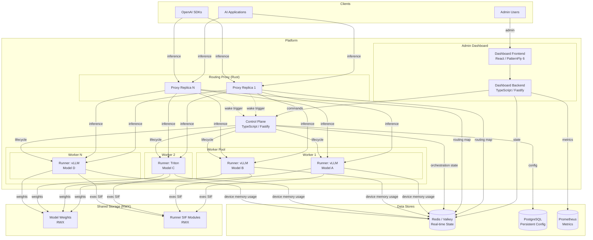
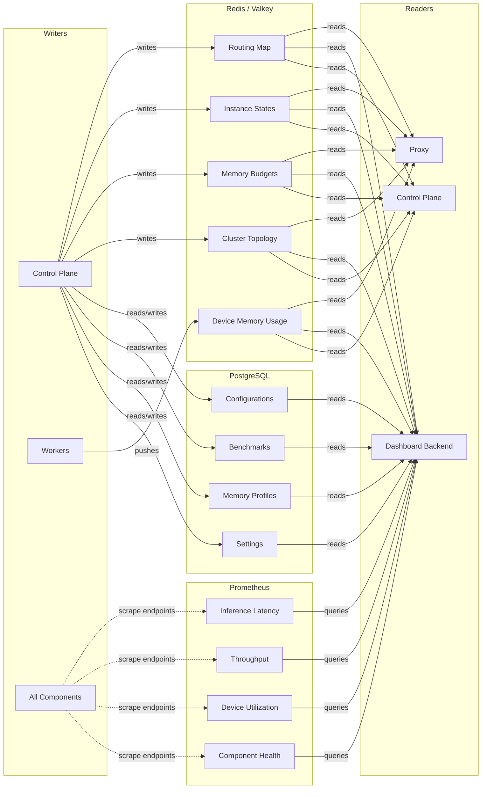
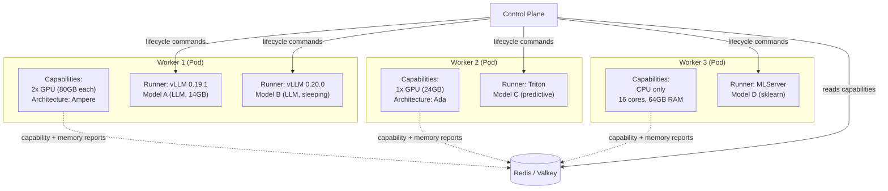
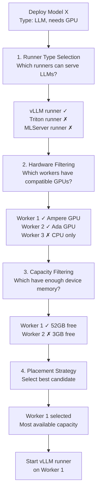
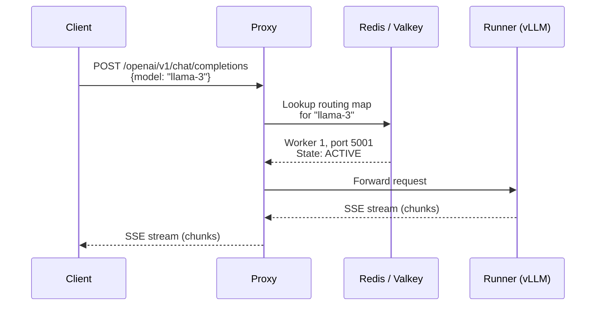
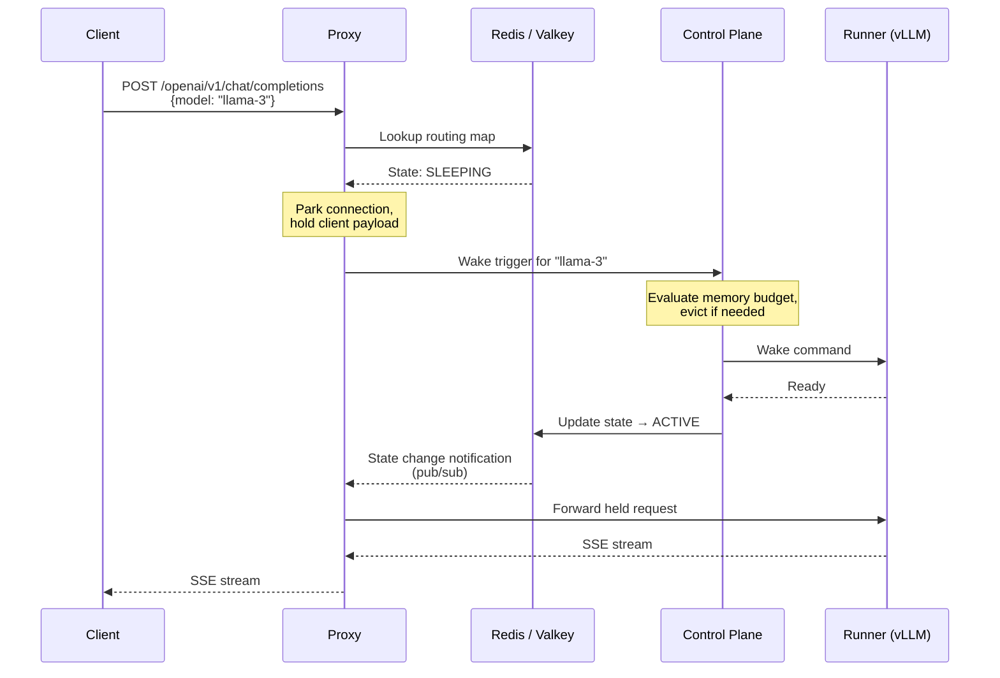
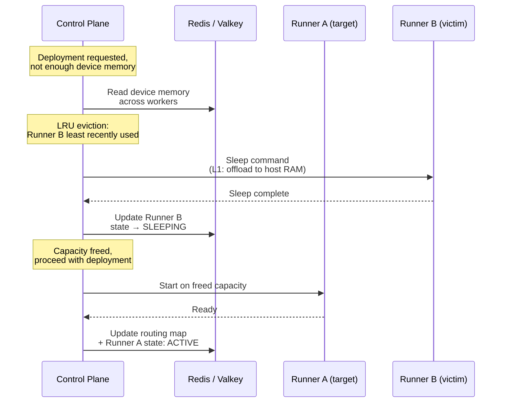
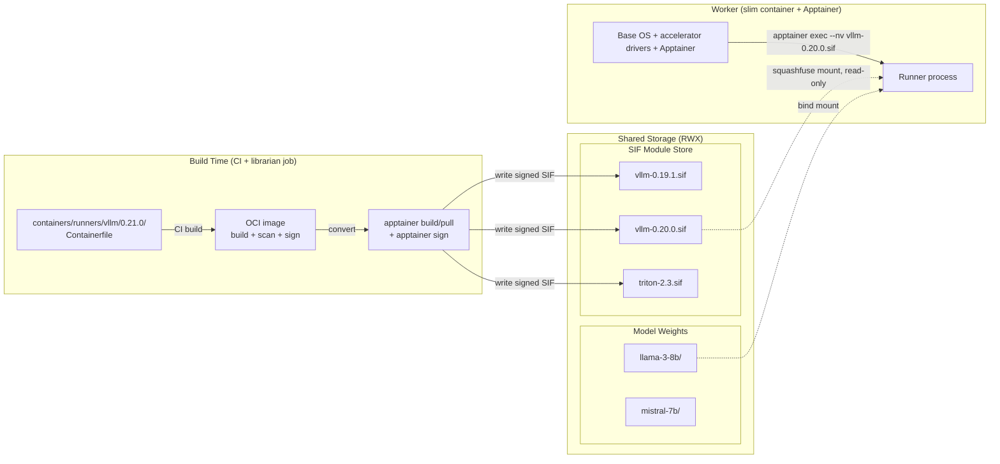
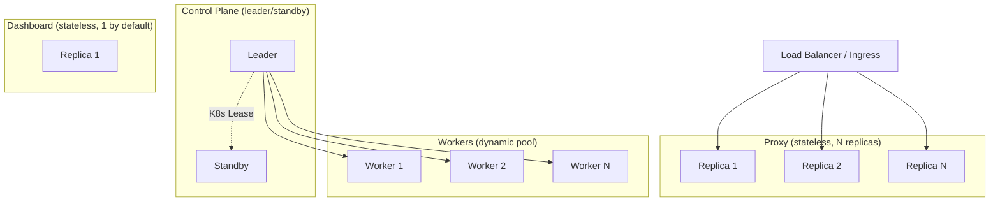
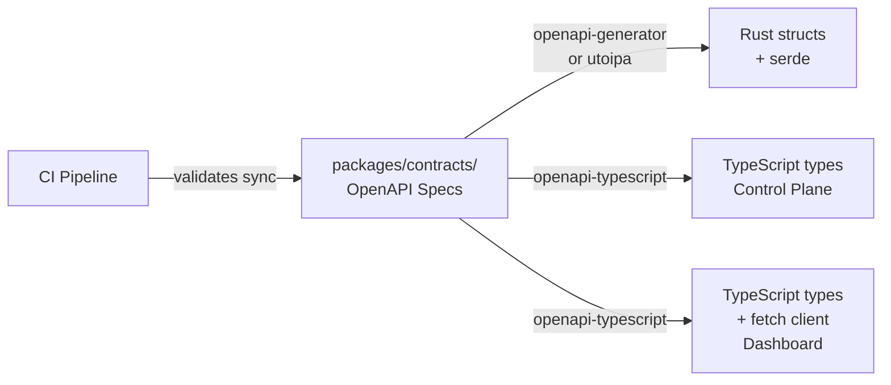

# Sardeenz v2 — Architecture Overview

## Introduction

Sardeenz is a high-density GPU workload orchestration platform that solves the accelerator multi-tenancy and overcommitment problem. It enables an enterprise cluster to host and serve more accelerator-based workloads (LLMs, diffusion models, predictive models) than can fit simultaneously in device memory — without the operational overhead, latency penalties, and resource rigidity of traditional frameworks.

The core paradigm: instead of letting Kubernetes allocate accelerators per-workload at the infrastructure level (L3), Sardeenz permanently assigns accelerator blocks to persistent worker processes and manages workload placement at the application level (L7). Kubernetes sees static, warm containers. Sardeenz sees a fluid canvas of device memory that can be packed, swapped, paged, or put to sleep on the fly.

> See [ADR-001](adrs/adr-001-l7-vram-scheduling.md) for the full rationale.

## High-Level Architecture



The platform comprises four main components, three data stores, and a shared storage fabric. Each component has a strict responsibility boundary and communicates through well-defined interfaces.

> See [ADR-002](adrs/adr-002-four-component-split.md) for the component split rationale.

## Component Details

### Routing Proxy

|              |                                             |
| ------------ | ------------------------------------------- |
| **Language** | Rust (axum / tokio)                         |
| **Role**     | Stateless, high-performance request routing |
| **Scaling**  | Multiple replicas behind a load balancer    |

The proxy sits on the critical path of every inference request. It reads a routing map from Redis/Valkey to resolve which worker and runner should handle each request, then forwards the traffic.

Key capabilities:

- **Protocol modularity.** Initially supports OpenAI-compatible traffic (for vLLM). The architecture accommodates additional serving protocols (e.g., MLServer for predictive models) as new model types are added.
- **Connection parking.** When a request targets a sleeping model, the proxy holds the client connection open and fires a wake-up trigger to the control plane. Once the model is ready, the proxy seamlessly connects the client to the live engine stream.
- **Thundering herd prevention.** If multiple requests hit the same sleeping model simultaneously, only the first triggers a wake-up. Subsequent requests are parked without redundant control plane calls.
- **Cluster forwarding.** Routes requests across workers with weighted round-robin and circuit breaking.

> See [ADR-003](adrs/adr-003-rust-proxy.md) for the Rust choice rationale.

### Control Plane

|              |                                                 |
| ------------ | ----------------------------------------------- |
| **Language** | TypeScript (Fastify)                            |
| **Role**     | Orchestration, scheduling, lifecycle management |
| **Scaling**  | Single leader with standby failover (K8s Lease) |

The control plane is the brain of the system. It does not serve inference traffic — it makes decisions about where workloads run and how device memory is allocated.

Key responsibilities:

- **Device memory budget tracking.** Maintains a global view of device memory allocation across all workers, built from worker self-reports in Redis/Valkey. Reports carry two distinct figures per device: the _allocation ledger_ (sum of running runners' configured `requiredMemory` — the basis for placement and eviction) and, where the worker can measure (NVML via ts-nvml, #163), the _measured_ usage including per-instance attribution — surfaced as telemetry (`currentMemory`, per-device measured bytes) but never fed into budget math.
- **Model lifecycle state machine.** Manages model states (starting, active, sleeping, stopping) and transitions.
- **Eviction.** When device memory is constrained, applies an eviction strategy (initially LRU, behind a pluggable interface) to free capacity by sleeping or stopping models.
- **Sleep/wake coordination.** Sends sleep and wake commands to runners through the runner contract.
- **Workload placement.** Matches model requirements → compatible runner type → capable worker → best candidate (see [Worker and Runner Model](#worker-and-runner-model)). Operators can also move one active instance to an explicit compatible worker and device set. A durable transaction creates a healthy replacement, atomically sets the old endpoint's weight to zero, waits for every serving proxy to apply and quiesce the old routing generation, then drains and stops the source; leader reconciliation resumes any interrupted phase.
- **Routing map management.** Writes the routing map to Redis/Valkey, which the proxy consumes.
- **Worker pool management.** Detects workers joining or leaving the pool dynamically without requiring a restart.
- **Runner catalog + SIF import.** Loads a catalog of available runner SIFs and imports them on demand by pulling signed SIFs from an OCI registry (ORAS) onto the shared module store — see [ADR-018](adrs/adr-018-runner-catalog-oras-distribution.md).

### Admin Dashboard

|              |                                                          |
| ------------ | -------------------------------------------------------- |
| **Frontend** | React 18 + PatternFly 6 + Vite                           |
| **Backend**  | TypeScript (Fastify) — BFF pattern                       |
| **Scaling**  | Single replica by default, stateless, scalable on demand |

The dashboard is a backend + frontend pair. The backend acts as a BFF (backend-for-frontend), aggregating data from multiple sources independently — it is not a pass-through to the control plane.

Data sources:

- **Control plane API** — for orchestration commands (deploy model, trigger sleep/wake, apply presets)
- **Redis / Valkey** — for real-time cluster state (model states, device memory usage, topology)
- **Prometheus** — for metrics visualization (inference latency, throughput, device utilization)

This independence means the dashboard can display cluster state and metrics even during a brief control plane failover.

### Engine Runners

|                          |                                    |
| ------------------------ | ---------------------------------- |
| **Role**                 | Engine-specific workload execution |
| **First implementation** | vLLM runner (reference)            |

Each worker runs a three-layer process architecture:

1. **Worker agent** — a long-lived management process inside the worker Pod. It self-registers to Redis/Valkey (capabilities, devices, heartbeat), receives commands from the control plane to start and stop runners, and exposes an HTTP management API (`POST /runners`, `DELETE /runners/{runnerId}`).

2. **Runner** — a separate process spawned by the worker agent, one per model **instance**. A logical model may have several instances (replicas) — including more than one on the same worker — each with its own runner process (see [ADR-019](adrs/adr-019-logical-model-vs-instance-split.md)). Each runner is a thin engine-specific shim that:
   - Executes its engine **SIF** in place — `apptainer exec --nv /modules/<engine>-<version>.sif <serve cmd>` — from the shared RWX module store (no per-host copy)
   - Runs the actual engine as the exec'd process
   - Exposes the runner contract HTTP API (`/health`, `/sleep`, `/wake`, `/memory-report`) on its own port

3. **Engine** (vLLM, Triton, etc.) — the unmodified inference engine, packaged in the SIF and run by `apptainer exec`. The engine has no knowledge of Sardeenz.

The runner is the isolation boundary — each runner exec's its own self-contained SIF (its own filesystem and userland), allowing different engine types and versions to coexist on the same worker. See [Why runners are separate processes](#why-runners-are-separate-processes) for the rationale.

> See [ADR-015](adrs/adr-015-sif-runtime-packaging.md) for the SIF runtime-delivery decision.

**The runner contract** defines the HTTP endpoints each runner exposes:

- **Health checking** — readiness detection, state reporting
- **Memory reporting** — per-device memory consumption
- **Sleep/wake support** — memory offload API (optional, not all engines support this)
- **Progress reporting** — structured loading progress
- **Capability declaration** — supported platform features (tensor parallelism, sleep levels, model types)

Process lifecycle (start, stop, drain) is a worker-level concern — the worker agent manages runner processes, and the control plane manages the routing map.

> See [ADR-010](adrs/adr-010-engine-runners.md) for the runner abstraction design. See [`components/runner-contract.md`](components/runner-contract.md) for the full contract specification.

## Data Architecture



Data is split across three purpose-matched stores:

| Store              | What                                                                                                                 | Why                                                                                                                                                   |
| ------------------ | -------------------------------------------------------------------------------------------------------------------- | ----------------------------------------------------------------------------------------------------------------------------------------------------- |
| **Redis / Valkey** | Routing map, instance lifecycle states, device memory budgets, worker-reported device memory usage, cluster topology | Sub-millisecond reads for the proxy. Pub/sub for state change notifications. Workers push their own device memory data, inverting v1's polling model. |
| **PostgreSQL**     | Configurations, instance placement ledger, benchmarks, memory profiles, persistent settings                          | Durability, queryability, transactional guarantees for data that must survive restarts.                                                               |
| **Prometheus**     | Inference metrics, device utilization, proxy stats, component health                                                 | Time-series collection via scrape endpoints. Dashboard reads directly for monitoring views.                                                           |

> See [ADR-009](adrs/adr-009-state-and-persistence.md) for the full rationale.

**Model configuration (logical model) vs. instance.** A _model configuration_ (Postgres `models` —
config: runner type, weights path, memory requirement, etc.) may have zero or more _instances_ (one
runner process on one worker each, with its own lifecycle state, VRAM reservation, and routing
endpoint — identified by a control-plane-minted `instanceId`). A configuration carries distinct
name concepts: its unique _configuration name_ (wire field `modelName` — the routing key clients
send in the OpenAI `model` field), an optional _served model name_ (the identity the engine
reports in metrics and responses; defaults to the configuration name), an optional _display name_
(free-form dashboard label, presentation only), and the _model path_ (the weights reference) — see
[ADR-020](adrs/adr-020-config-name-vs-served-model-name.md).
Instance lifecycle state lives in Redis, one key per instance (`{prefix}:models:{modelName}:{instanceId}`); a lightweight
Postgres `instances` table is the durable identity/placement ledger, written at instance create/
delete. The model's own state (`ACTIVE`, `SLEEPING`, etc., as surfaced by the API and dashboard) is
derived from its instances on read — the highest-precedence state present, with `ACTIVE` outranking
`ERROR` so one healthy replica masks a broken one. See [ADR-019](adrs/adr-019-logical-model-vs-instance-split.md).

## Worker and Runner Model



**Workers** are long-lived Pods with one or more accelerators (or CPU capacity). Each worker runs a **worker agent** process that manages the runners on that node.

**Runners** are short-lived relative to workers — started, stopped, slept, and woken by the control plane. Each runner is typed to a specific engine and runs a single workload.

### Process Tree

Each worker Pod runs a worker agent that spawns and supervises runners. Each runner exec's its own engine SIF from the shared module store:

```text
Worker agent (long-lived, manages everything)
├── Runner A: apptainer exec --nv vllm-0.19.1.sif → serve model X on :5001
├── Runner B: apptainer exec --nv vllm-0.20.0.sif → serve model Y on :5002
└── Runner C: apptainer exec --nv triton-2.40.sif → serve model Z on :5003
```

### Communication Channels

| Channel                       | Direction            | Purpose                                                                 |
| ----------------------------- | -------------------- | ----------------------------------------------------------------------- |
| Control plane → Worker agent  | Process management   | `POST /runners` to start a runner, `DELETE /runners/{id}` to stop one   |
| Control plane → Runner        | Lifecycle management | `/health`, `/sleep`, `/wake` — the runner contract                      |
| Proxy → Runner                | Inference traffic    | Direct request forwarding, no control plane involvement on the hot path |
| Worker agent → Redis / Valkey | Self-registration    | Capabilities, devices, heartbeat, management URL                        |

### Why Runners Are Separate Processes

The key constraint is **runtime isolation**. Running multiple engines or engine versions on the same worker requires each to have its own filesystem, libraries, and Python environment. A separate process per runner provides this naturally — each runner `apptainer exec`s its own **SIF**, a single self-contained squashfs image with the full engine userland, mounted read-only in the runner's own mount namespace. Different engine types and versions coexist with zero cross-contamination, and none of it is baked into the worker image.

> See [ADR-015](adrs/adr-015-sif-runtime-packaging.md) for the SIF runtime-delivery decision and [ADR-010](adrs/adr-010-engine-runners.md) for the runner abstraction design.

### Workload Placement

When a model deployment request arrives, the control plane resolves a multi-level matching problem:



Workers self-report their capabilities and device memory usage to Redis/Valkey. The control plane reads this data to build its placement decisions — it does not poll workers directly.

> See [ADR-011](adrs/adr-011-worker-capabilities-and-placement.md) for the full placement design, including its relationship to infrastructure-level schedulers.

## Request Flows

The proxy serves two protocol-family path prefixes on its inference port: `/openai/v1/*` (OpenAI-
compatible, shown below) and `/oip/v2/*` (KServe V2 Open Inference Protocol, e.g. MLServer models).
See [ADR-021](adrs/adr-021-protocol-family-path-prefixes.md) and
[`components/proxy.md`](components/proxy.md#overview) for the full endpoint surface.

### Inference Request — Model is Active



The proxy resolves the target from the routing map in Redis/Valkey and forwards directly. No control plane involvement on the hot path.

### Inference Request — Model is Sleeping



The proxy parks the client connection while the model wakes. If multiple clients request the same sleeping model, the thundering herd mechanism ensures only one wake trigger reaches the control plane.

### Model Deployment


### Eviction Under Memory Pressure



## Runtime Delivery — Apptainer SIF

Engine runtimes are not baked into worker container images, nor loaded as Lmod modules
(the original Highlander/EasyBuild plan — see [ADR-004](adrs/adr-004-highlander-runtime.md),
superseded). Instead, each runtime is packaged as an **Apptainer SIF** — a single squashfs file
containing a whole OCI image — stored on a shared RWX volume and executed in place with
`apptainer exec`. A "runner module" is one `.sif` file.



Worker container images are slim — base OS, accelerator drivers, and Apptainer
(`containers/worker-base/`). When the control plane instructs a worker to start a runner, the
worker `apptainer exec`s the engine SIF straight off the shared volume; `squashfuse` mounts it
read-only and pages it in lazily (no per-host copy, no metadata storm).

This enables:

- **Fast engine iteration** — drop a new `.sif` on the volume; no container rebuild cycle
- **Hot-add without recycling workers** — a new SIF is runnable immediately, no Pod restart
- **Zero-downtime upgrades** — new version execs as a parallel process, proxy shifts traffic, old process drains
- **Canary / A/B testing** — two engine versions serve traffic side-by-side from the same worker

Runner `Containerfile`s and the base worker image live in this repository under `containers/`,
making Sardeenz fully self-contained. The SIFs are built, signed, and published by Sardeenz's
own pipeline; workers verify signatures at exec.

> See [ADR-015](adrs/adr-015-sif-runtime-packaging.md) (SIF delivery),
> [ADR-016](adrs/adr-016-sif-worker-security-posture.md) (the mild SCC + `/dev/fuse` posture),
> and [ADR-017](adrs/adr-017-runner-image-pipeline.md) (build/sign/convert pipeline). The Phase 4
> feasibility spike that validated this is [`docs/project/phase4-apptainer-spike.md`](../project/phase4-apptainer-spike.md).

## Scaling and Redundancy



Each component scales according to its workload profile:

| Component           | Strategy                                           | Rationale                                                                                                              |
| ------------------- | -------------------------------------------------- | ---------------------------------------------------------------------------------------------------------------------- |
| **Routing Proxy**   | Multiple stateless replicas behind a load balancer | On the critical path of every request. Horizontally scalable.                                                          |
| **Control Plane**   | Single leader with standby failover (K8s Lease)    | Coordination workload is moderate. Leader/standby avoids multi-writer complexity. Inference continues during failover. |
| **Admin Dashboard** | Single replica by default, stateless and scalable  | Doesn't affect inference. Scales to multiple replicas without code changes if needed.                                  |
| **Workers**         | Dynamic pool, manual provisioning initially        | Workers join/leave without control plane restart. Extensible to autoscaling later.                                     |

> See [ADR-007](adrs/adr-007-redundancy-and-scaling.md) for the full scaling rationale.

## Cross-Language Contracts

The Rust proxy and TypeScript components share type definitions through OpenAPI specifications maintained in `packages/contracts/`.



Contracts cover:

- **Proxy ↔ Control Plane** — routing map schema, model states, wake-up trigger API
- **Dashboard ↔ Control Plane** — model lifecycle operations, device memory budgets, cluster state, event streams
- **Engine Runner Contract** — health check, memory reporting, lifecycle signals, capability declaration

The workflow: edit the OpenAPI spec → run code generation → TypeScript types are regenerated automatically. Rust types in `proxy/src/generated/` are hand-maintained to match the specs (see `docs/project/phase1.md` task 1.3 for rationale).

> See [ADR-005](adrs/adr-005-openapi-contracts.md) for the contract strategy rationale.

## ADR Index

| ADR                                                          | Decision                                                                                 |
| ------------------------------------------------------------ | ---------------------------------------------------------------------------------------- |
| [ADR-001](adrs/adr-001-l7-vram-scheduling.md)                | Software-defined device memory scheduling at Layer 7                                     |
| [ADR-002](adrs/adr-002-four-component-split.md)              | Four-component architecture split                                                        |
| [ADR-003](adrs/adr-003-rust-proxy.md)                        | Rust for the routing proxy                                                               |
| [ADR-004](adrs/adr-004-highlander-runtime.md)                | Highlander runtime integration with self-contained easyconfigs _(superseded by ADR-015)_ |
| [ADR-005](adrs/adr-005-openapi-contracts.md)                 | OpenAPI as cross-language contract                                                       |
| [ADR-006](adrs/adr-006-new-platform.md)                      | New platform vs. v1 refactor                                                             |
| [ADR-007](adrs/adr-007-redundancy-and-scaling.md)            | Redundancy and scaling strategy                                                          |
| [ADR-008](adrs/adr-008-monorepo.md)                          | Monorepo structure                                                                       |
| [ADR-009](adrs/adr-009-state-and-persistence.md)             | Shared state and persistence strategy                                                    |
| [ADR-010](adrs/adr-010-engine-runners.md)                    | Engine runners                                                                           |
| [ADR-011](adrs/adr-011-worker-capabilities-and-placement.md) | Worker capabilities and workload placement                                               |
| [ADR-012](adrs/adr-012-typescript-stack.md)                  | TypeScript stack for control plane and dashboard                                         |
| [ADR-013](adrs/adr-013-secrets-management.md)                | Secrets management policy                                                                |
| [ADR-014](adrs/adr-014-inference-recency-tracking.md)        | Inference recency tracking for LRU eviction                                              |
| [ADR-015](adrs/adr-015-sif-runtime-packaging.md)             | Engine runtime delivery via Apptainer SIF on shared RWX storage                          |
| [ADR-016](adrs/adr-016-sif-worker-security-posture.md)       | Worker security posture for SIF execution                                                |
| [ADR-017](adrs/adr-017-runner-image-pipeline.md)             | Runner image build and supply chain _(amended by ADR-018)_                               |
| [ADR-018](adrs/adr-018-runner-catalog-oras-distribution.md)  | Runner catalog and ORAS distribution _(amends ADR-017)_                                  |
| [ADR-019](adrs/adr-019-logical-model-vs-instance-split.md)   | Logical model vs. instance split _(refines ADR-014)_                                     |
| [ADR-020](adrs/adr-020-config-name-vs-served-model-name.md)  | Configuration name vs. served model name _(refines ADR-019; amended by ADR-021)_         |
| [ADR-021](adrs/adr-021-protocol-family-path-prefixes.md)     | Protocol-family path prefixes for multi-protocol runners _(amends ADR-020)_              |

---

**Note:** The [original design brief](archive/refactor-brief.md) that seeded this project is preserved in the archive for historical reference. Architecture and scope have evolved since; this overview and the ADRs above are the current source of truth.
