# Sardeenz v2 — Architecture Overview

## Introduction

Sardeenz is a high-density GPU workload orchestration platform that solves the accelerator multi-tenancy and overcommitment problem. It enables an enterprise cluster to host and serve more accelerator-based workloads (LLMs, diffusion models, predictive models) than can fit simultaneously in device memory — without the operational overhead, latency penalties, and resource rigidity of traditional frameworks.

The core paradigm: instead of letting Kubernetes allocate accelerators per-workload at the infrastructure level (L3), Sardeenz permanently assigns accelerator blocks to persistent worker processes and manages workload placement at the application level (L7). Kubernetes sees static, warm containers. Sardeenz sees a fluid canvas of device memory that can be packed, swapped, paged, or put to sleep on the fly.

> See [ADR-001](adrs/adr-001-l7-vram-scheduling.md) for the full rationale.

## High-Level Architecture

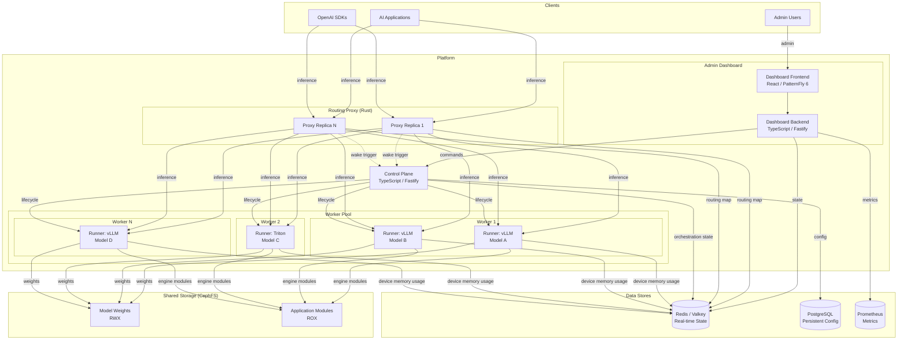

The platform comprises four main components, three data stores, and a shared storage fabric. Each component has a strict responsibility boundary and communicates through well-defined interfaces.

> See [ADR-002](adrs/adr-002-four-component-split.md) for the component split rationale.

## Component Details

### Routing Proxy

|              |                                             |
| ------------ | ------------------------------------------- |
| **Language** | Rust (axum / tokio)                         |
| **Role**     | Stateless, high-performance request routing |
| **Scaling**  | Multiple replicas behind a load balancer    |

The proxy sits on the critical path of every inference request. It reads a routing map from Redis/Valkey to resolve which worker and runner should handle each request, then forwards the traffic.

Key capabilities:

- **Protocol modularity.** Initially supports OpenAI-compatible traffic (for vLLM). The architecture accommodates additional serving protocols (e.g., MLServer for predictive models) as new model types are added.
- **Connection parking.** When a request targets a sleeping model, the proxy holds the client connection open and fires a wake-up trigger to the control plane. Once the model is ready, the proxy seamlessly connects the client to the live engine stream.
- **Thundering herd prevention.** If multiple requests hit the same sleeping model simultaneously, only the first triggers a wake-up. Subsequent requests are parked without redundant control plane calls.
- **Cluster forwarding.** Routes requests across workers with weighted round-robin and circuit breaking.

> See [ADR-003](adrs/adr-003-rust-proxy.md) for the Rust choice rationale.

### Control Plane

|              |                                                 |
| ------------ | ----------------------------------------------- |
| **Language** | TypeScript (Fastify)                            |
| **Role**     | Orchestration, scheduling, lifecycle management |
| **Scaling**  | Single leader with standby failover (K8s Lease) |

The control plane is the brain of the system. It does not serve inference traffic — it makes decisions about where workloads run and how device memory is allocated.

Key responsibilities:

- **Device memory budget tracking.** Maintains a global view of device memory allocation across all workers, built from worker self-reports in Redis/Valkey.
- **Model lifecycle state machine.** Manages model states (starting, active, sleeping, stopping) and transitions.
- **Eviction.** When device memory is constrained, applies an eviction strategy (initially LRU, behind a pluggable interface) to free capacity by sleeping or stopping models.
- **Sleep/wake coordination.** Sends sleep and wake commands to runners through the runner contract.
- **Workload placement.** Matches model requirements → compatible runner type → capable worker → best candidate (see [Worker and Runner Model](#worker-and-runner-model)).
- **Routing map management.** Writes the routing map to Redis/Valkey, which the proxy consumes.
- **Worker pool management.** Detects workers joining or leaving the pool dynamically without requiring a restart.

### Admin Dashboard

|              |                                                          |
| ------------ | -------------------------------------------------------- |
| **Frontend** | React 18 + PatternFly 6 + Vite                           |
| **Backend**  | TypeScript (Fastify) — BFF pattern                       |
| **Scaling**  | Single replica by default, stateless, scalable on demand |

The dashboard is a backend + frontend pair. The backend acts as a BFF (backend-for-frontend), aggregating data from multiple sources independently — it is not a pass-through to the control plane.

Data sources:

- **Control plane API** — for orchestration commands (deploy model, trigger sleep/wake, apply presets)
- **Redis / Valkey** — for real-time cluster state (model states, device memory usage, topology)
- **Prometheus** — for metrics visualization (inference latency, throughput, device utilization)

This independence means the dashboard can display cluster state and metrics even during a brief control plane failover.

### Engine Runners

|                          |                                    |
| ------------------------ | ---------------------------------- |
| **Role**                 | Engine-specific workload execution |
| **First implementation** | vLLM runner (reference)            |

Each worker runs a three-layer process architecture:

1. **Worker agent** — a long-lived management process inside the worker Pod. It self-registers to Redis/Valkey (capabilities, devices, heartbeat), receives commands from the control plane to start and stop runners, and exposes an HTTP management API (`POST /runners`, `DELETE /runners/{runnerId}`).

2. **Runner** — a separate process spawned by the worker agent, one per model. Each runner is a thin engine-specific shim that:
   - Runs `module load <engine>/<version>` to set up its isolated Lmod environment
   - Spawns the actual engine process as a child
   - Exposes the runner contract HTTP API (`/health`, `/sleep`, `/wake`, `/memory-report`) on its own port

3. **Engine** (vLLM, Triton, etc.) — the unmodified inference engine, started and managed by its parent runner. The engine has no knowledge of Sardeenz.

The runner is the isolation boundary — each runner has its own Lmod environment, allowing different engine types and versions to coexist on the same worker. See [Why runners are separate processes](#why-runners-are-separate-processes) for the rationale.

**The runner contract** defines the HTTP endpoints each runner exposes:

- **Health checking** — readiness detection, state reporting
- **Memory reporting** — per-device memory consumption
- **Sleep/wake support** — memory offload API (optional, not all engines support this)
- **Progress reporting** — structured loading progress
- **Capability declaration** — supported platform features (tensor parallelism, sleep levels, model types)

Process lifecycle (start, stop, drain) is a worker-level concern — the worker agent manages runner processes, and the control plane manages the routing map.

> See [ADR-010](adrs/adr-010-engine-runners.md) for the runner abstraction design. See [`components/runner-contract.md`](components/runner-contract.md) for the full contract specification.

## Data Architecture

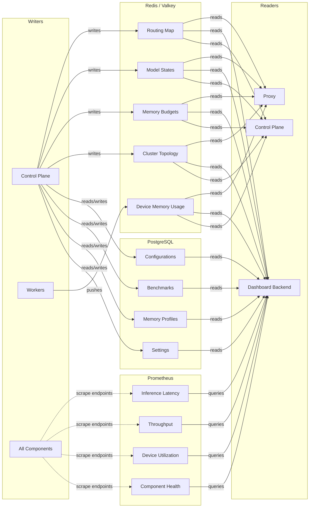

Data is split across three purpose-matched stores:

| Store              | What                                                                                                    | Why                                                                                                                                                   |
| ------------------ | ------------------------------------------------------------------------------------------------------- | ----------------------------------------------------------------------------------------------------------------------------------------------------- |
| **Redis / Valkey** | Routing map, model states, device memory budgets, worker-reported device memory usage, cluster topology | Sub-millisecond reads for the proxy. Pub/sub for state change notifications. Workers push their own device memory data, inverting v1's polling model. |
| **PostgreSQL**     | Configurations, benchmarks, memory profiles, persistent settings                                        | Durability, queryability, transactional guarantees for data that must survive restarts.                                                               |
| **Prometheus**     | Inference metrics, device utilization, proxy stats, component health                                    | Time-series collection via scrape endpoints. Dashboard reads directly for monitoring views.                                                           |

> See [ADR-009](adrs/adr-009-state-and-persistence.md) for the full rationale.

## Worker and Runner Model

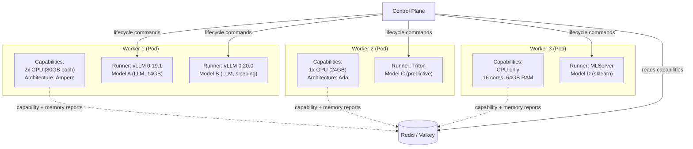

**Workers** are long-lived Pods with one or more accelerators (or CPU capacity). Each worker runs a **worker agent** process that manages the runners on that node.

**Runners** are short-lived relative to workers — started, stopped, slept, and woken by the control plane. Each runner is typed to a specific engine and runs a single workload.

### Process Tree

Each worker Pod runs a worker agent that spawns and supervises runners. Each runner loads its own Lmod environment and spawns its engine as a child process:

```text
Worker agent (long-lived, manages everything)
├── Runner A: module load vllm/0.19.1 → spawn vLLM → serve model X on :5001
├── Runner B: module load vllm/0.20.0 → spawn vLLM → serve model Y on :5002
└── Runner C: module load triton/2.40 → spawn Triton → serve model Z on :5003
```

### Communication Channels

| Channel                          | Direction                | Purpose                                                                      |
| -------------------------------- | ------------------------ | ---------------------------------------------------------------------------- |
| Control plane → Worker agent     | Process management       | `POST /runners` to start a runner, `DELETE /runners/{id}` to stop one        |
| Control plane → Runner           | Lifecycle management     | `/health`, `/sleep`, `/wake` — the runner contract                           |
| Proxy → Runner                   | Inference traffic        | Direct request forwarding, no control plane involvement on the hot path      |
| Worker agent → Redis / Valkey    | Self-registration        | Capabilities, devices, heartbeat, management URL                             |

### Why Runners Are Separate Processes

The key constraint is **Lmod environment isolation**. Lmod works by modifying `PATH`, `LD_LIBRARY_PATH`, `PYTHONPATH`, and other environment variables in the shell environment. Running multiple engines or engine versions on the same worker requires each to have its own isolated environment. A separate process per runner provides this naturally — each runner does its own `module load` and inherits the resulting environment. Trying to manage per-model environments within a single worker agent process would be fragile and fight against how Lmod is designed.

> See [ADR-004](adrs/adr-004-highlander-runtime.md) for the Highlander integration rationale and [ADR-010](adrs/adr-010-engine-runners.md) for the runner abstraction design.

### Workload Placement

When a model deployment request arrives, the control plane resolves a multi-level matching problem:

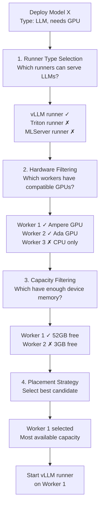

Workers self-report their capabilities and device memory usage to Redis/Valkey. The control plane reads this data to build its placement decisions — it does not poll workers directly.

> See [ADR-011](adrs/adr-011-worker-capabilities-and-placement.md) for the full placement design, including its relationship to infrastructure-level schedulers.

## Request Flows

### Inference Request — Model is Active

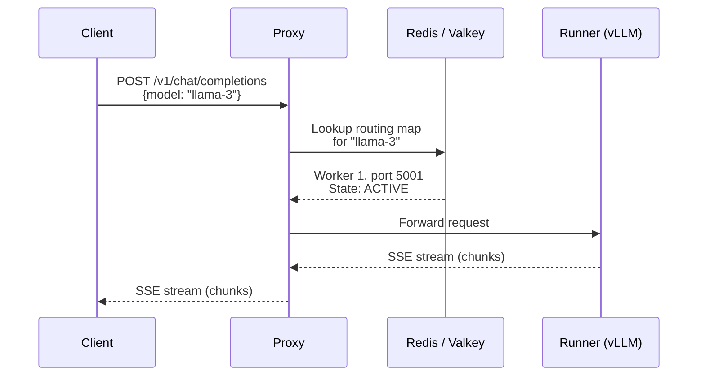

The proxy resolves the target from the routing map in Redis/Valkey and forwards directly. No control plane involvement on the hot path.

### Inference Request — Model is Sleeping

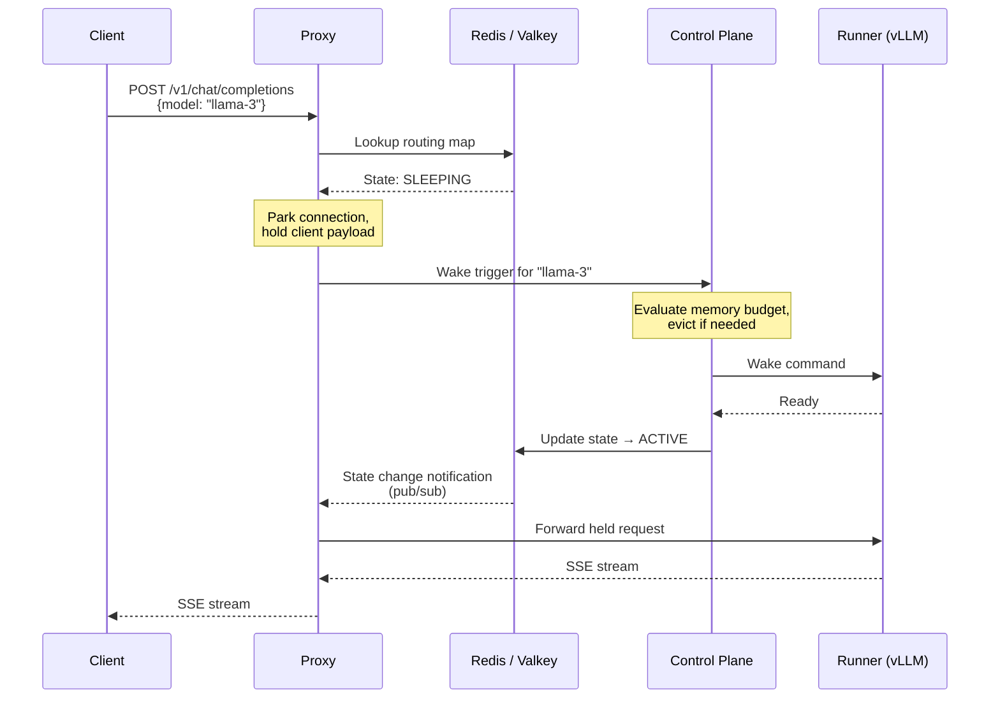

The proxy parks the client connection while the model wakes. If multiple clients request the same sleeping model, the thundering herd mechanism ensures only one wake trigger reaches the control plane.

### Model Deployment

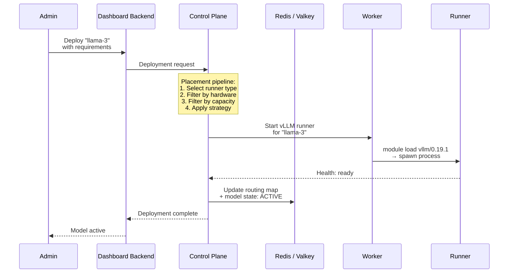

### Eviction Under Memory Pressure

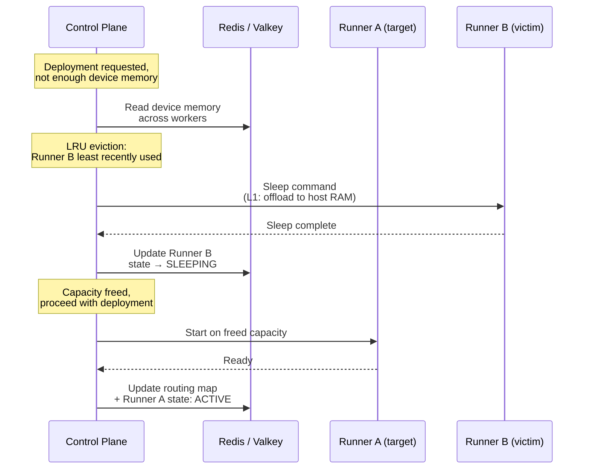

## Highlander Runtime

Engine runtimes are not baked into container images. Instead, workers use the Highlander model: runtimes are packaged as Lmod environment modules via EasyBuild and stored on shared network storage.

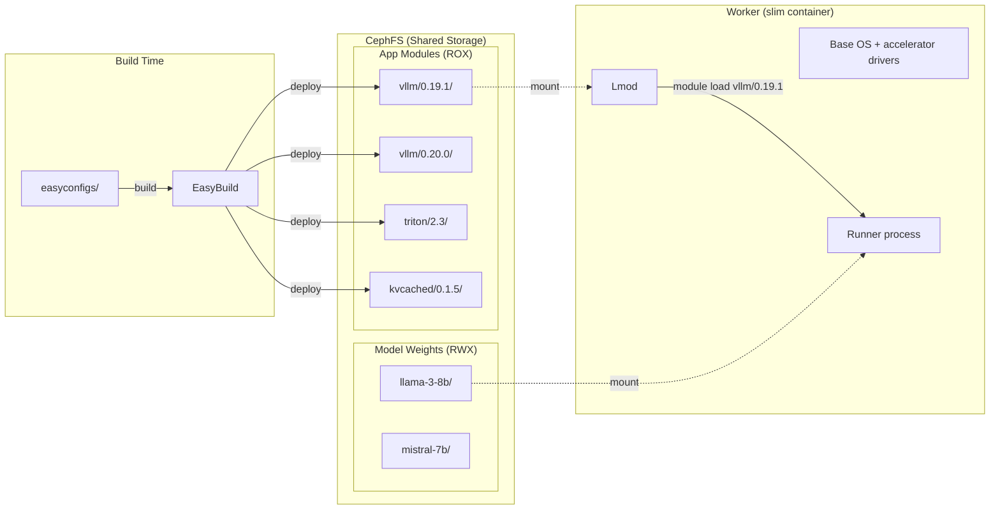

Worker container images are slim — just a base OS and accelerator drivers. When the control plane instructs a worker to start a runner, the worker invokes `module load <engine>/<version>` to compose the runtime environment, then spawns the engine process.

This enables:

- **Fast engine iteration** — switch versions in seconds, not container rebuild cycles
- **Zero-downtime upgrades** — new version spawns as a parallel process, proxy shifts traffic, old process drains
- **Canary / A/B testing** — two engine versions serve traffic side-by-side from the same worker

Easyconfigs and the base worker container image live in this repository, making Sardeenz fully self-contained.

> See [ADR-004](adrs/adr-004-highlander-runtime.md) for the full Highlander integration rationale.

## Scaling and Redundancy

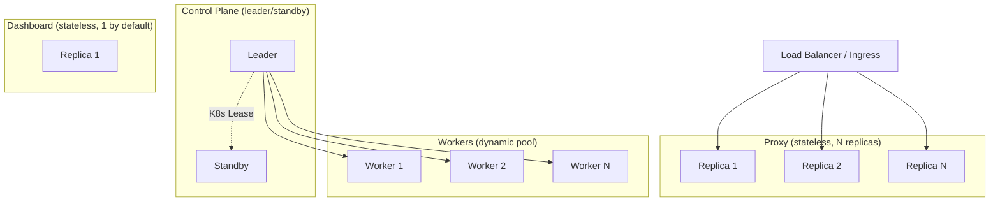

Each component scales according to its workload profile:

| Component           | Strategy                                           | Rationale                                                                                                              |
| ------------------- | -------------------------------------------------- | ---------------------------------------------------------------------------------------------------------------------- |
| **Routing Proxy**   | Multiple stateless replicas behind a load balancer | On the critical path of every request. Horizontally scalable.                                                          |
| **Control Plane**   | Single leader with standby failover (K8s Lease)    | Coordination workload is moderate. Leader/standby avoids multi-writer complexity. Inference continues during failover. |
| **Admin Dashboard** | Single replica by default, stateless and scalable  | Doesn't affect inference. Scales to multiple replicas without code changes if needed.                                  |
| **Workers**         | Dynamic pool, manual provisioning initially        | Workers join/leave without control plane restart. Extensible to autoscaling later.                                     |

> See [ADR-007](adrs/adr-007-redundancy-and-scaling.md) for the full scaling rationale.

## Cross-Language Contracts

The Rust proxy and TypeScript components share type definitions through OpenAPI specifications maintained in `packages/contracts/`.

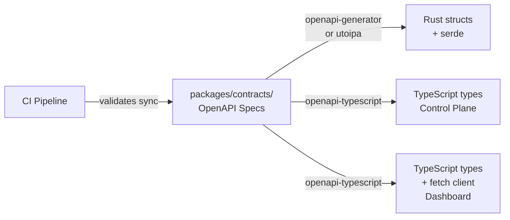

Contracts cover:

- **Proxy ↔ Control Plane** — routing map schema, model states, wake-up trigger API
- **Dashboard ↔ Control Plane** — model lifecycle operations, device memory budgets, cluster state, event streams
- **Engine Runner Contract** — health check, memory reporting, lifecycle signals, capability declaration

The workflow: edit the OpenAPI spec → run code generation → TypeScript types are regenerated automatically. Rust types in `proxy/src/generated/` are hand-maintained to match the specs (see `docs/project/phase1.md` task 1.3 for rationale).

> See [ADR-005](adrs/adr-005-openapi-contracts.md) for the contract strategy rationale.

## ADR Index

| ADR                                                          | Decision                                                       |
| ------------------------------------------------------------ | -------------------------------------------------------------- |
| [ADR-001](adrs/adr-001-l7-vram-scheduling.md)                | Software-defined device memory scheduling at Layer 7           |
| [ADR-002](adrs/adr-002-four-component-split.md)              | Four-component architecture split                              |
| [ADR-003](adrs/adr-003-rust-proxy.md)                        | Rust for the routing proxy                                     |
| [ADR-004](adrs/adr-004-highlander-runtime.md)                | Highlander runtime integration with self-contained easyconfigs |
| [ADR-005](adrs/adr-005-openapi-contracts.md)                 | OpenAPI as cross-language contract                             |
| [ADR-006](adrs/adr-006-new-platform.md)                      | New platform vs. v1 refactor                                   |
| [ADR-007](adrs/adr-007-redundancy-and-scaling.md)            | Redundancy and scaling strategy                                |
| [ADR-008](adrs/adr-008-monorepo.md)                          | Monorepo structure                                             |
| [ADR-009](adrs/adr-009-state-and-persistence.md)             | Shared state and persistence strategy                          |
| [ADR-010](adrs/adr-010-engine-runners.md)                    | Engine runners                                                 |
| [ADR-011](adrs/adr-011-worker-capabilities-and-placement.md) | Worker capabilities and workload placement                     |
| [ADR-012](adrs/adr-012-typescript-stack.md)                  | TypeScript stack for control plane and dashboard               |

---

**Note:** The [original design brief](archive/refactor-brief.md) that seeded this project is preserved in the archive for historical reference. Architecture and scope have evolved since; this overview and the ADRs above are the current source of truth.
